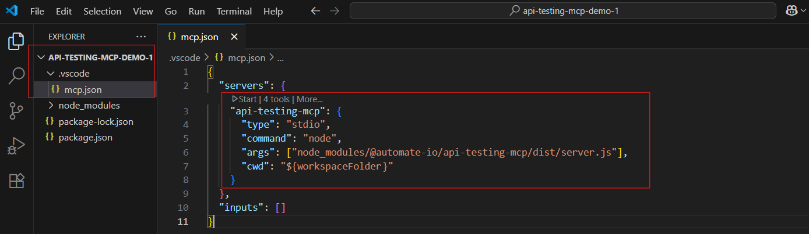

  
  <p align="center">
    
  </p>
  
  # API Testing Using MCP Server (End User Guide)

A ready-to-use Model Context Protocol (MCP) server for HTTP API testing, powered by Playwright. This guide helps you install, configure, and run the MCP server locally as an npm package.
<br>
<br>


## 📋 Table of Contents

- [Overview](#🌟-overview)
- [Prerequisites](#📋-prerequisites)
- [Setup](#🚀-setup)
- [Configurations](#⚙️-configurations)
- [Usage](#📖-getting-started-with-mcp-testing)
- [Example scenarios and prompts for MCP server usage](#✅-example-scenarios-and-prompts-for-mcp-server-usage)
- [Upcoming enhancements](#⏭️-upcoming-enhancements)
- [Troubleshooting](#🔧-troubleshooting)
- [Support](#🆘-support)
<br>
<br>


## 🌟 Overview   

The Playwright API MCP Server enables API testing via the Model Context Protocol. It supports GET, POST, PUT, and DELETE requests.

<br>
<br>

## 📋 Prerequisites

- **Node.js**: v18.0.0 or higher.
- **npm**: Comes with Node.js.
- **VS Code**: MCP-compatible client.
- **Github Copilot**: Make sure the GitHub Copilot extension is installed and enabled in VS Code.<br>  Watch the video to understand how to enable Github Copilot: https://www.youtube.com/watch?v=etP5wq4Zl20
- **How to use Github Copilot for free** Watch the Video: https://www.youtube.com/watch?v=X_Aet9ndh_Y <br>
<br>


## 🚀 Setup
1. **Create a Node.js Project in VS Code**:
      - Create a new folder with a meaningful name (e.g. `my-project`).
      - Open the folder in Visual Studio Code.
      - Launch the integrated terminal (via `View > Terminal`).
      - Choose your preferred shell (e.g. `Git Bash, Command Prompt, or PowerShell`).
      - Run the following command to initialise the project:
        ```
        npm init -y
        ```
      - This will generate a package.json file with default settings
  <br>

2. **Install the MCP Server Package**  
      - Now, run the below command to install the mcp server package.
        ```bash
        npm i @automate-io/api-testing-mcp@latest
        ```
<br>


## ⚙️ Configurations
1. Open your project folder in VS Code
2. If the `mcp.json` file does not already exist, create it inside the `root/.vscode/` directory.
If the file is already present, you can skip this step
3. Add the `api-testing-mcp` configuration under the `servers` key in the `mcp.json` file, as shown below

    

    ```json
    {
      "servers": {
        "api-testing-mcp": {
          "type": "stdio",
          "command": "node",
          "args": ["node_modules/@automate-io/api-testing-mcp/dist/server.js"],
          "cwd": "${workspaceFolder}"
        }
      },
      "inputs": []
    }
    ```
- **❗Important Note**:If you are working in a `monorepo`, ensure the `args` field in your `mcp.json` file is correctly configured. Refer to the [Monorepo MCP Configuration](./documentation/read-me/mcp-config-monorepo-vs-standalone.md) guide for detailed instructions.<br>
If your test code resides in a `standalone` repository, no changes are needed, you are good to go.
<br>
<br>


## 📖 Getting started with MCP testing

1. **Start the MCP Server**
  - Click the highlighted start button in the mcp.json file as shown below to start the MCP server.

    
    <br>


2. **Input the prompt** 
  
  - Open GitHub Copilot chat window in  VS Code with Agent mode selected.
  - Enter a prompt that outlines the API you wish to test.
  <br>
  <br>

  ## ✅ Example scenarios and prompts for MCP server usage
    
  - [Scenario 1](./documentation/read-me//scenario1.md) : To test all endpoints in one go.<br>
  - [Scenario 2](./documentation//read-me//scenario2.md) : To test a single endpoint.
<br>
<br>


## ⏭️ Upcoming enhancements
- Implement schema validations for response payloads  
- Add reusable resources to support API testing workflows  
- Introduce predefined prompts to streamline common scenarios
- Provide a sample HTML test report template to guide LLm about the layout and formatting
-  Refactor existing logic and implement robust error handling to improve reliability and maintainability
<br>
<br>


## 🔧 Troubleshooting
- **Server not running?**  
  Double-check your MCP client configuration.

- **Module not found?**  
  Reinstall the package:
  ```
  npm i @automate-io/api-testing-mcp@latest
  ```
<br>


## 🆘 Support

- Review this guide and your MCP client documentation.
- For issues, open [GitHub Issues](https://github.com/Naveen-Automation/mcp-server/issues) here.
- Consult [Model Context Protocol Documentation](https://modelcontextprotocol.io/).
---
<br>


## 👍 Enjoy exploring and validating your APIs !


