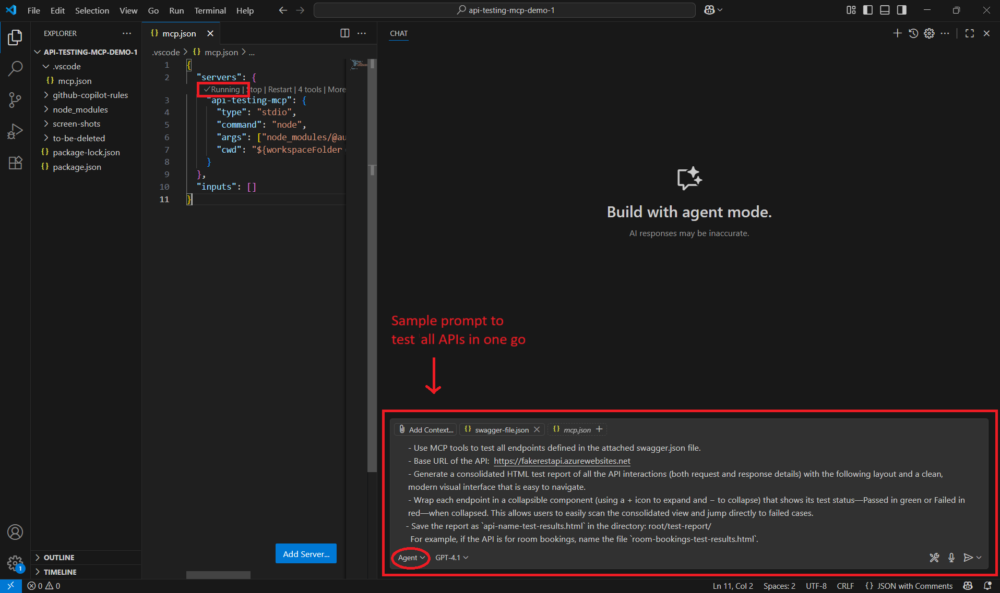
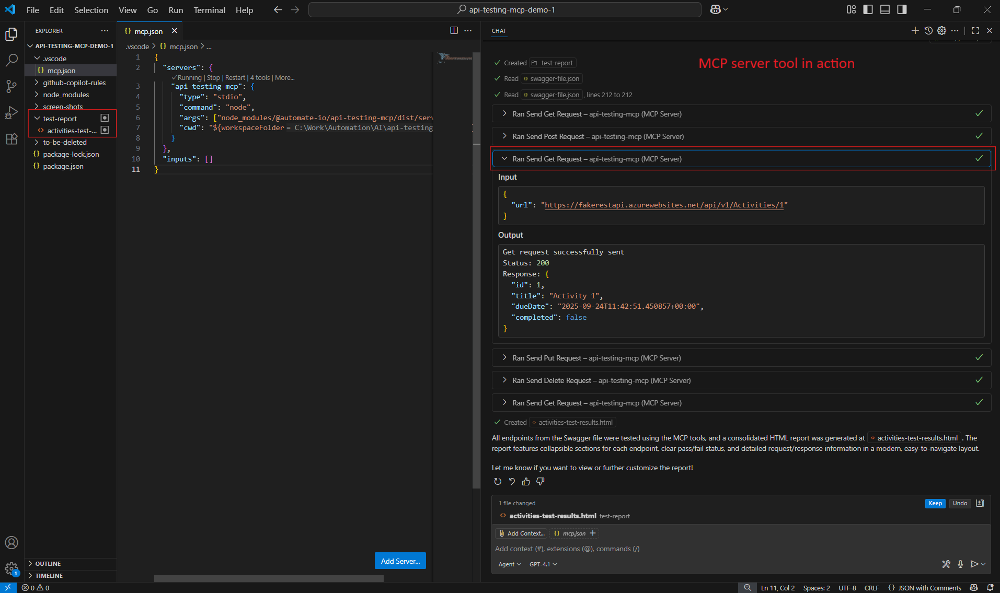

## Scenario 1:  
  - To test all endpoints in one go, attach the complete API specification (swagger.json) and prompt GitHub Copilot to run tests using the MCP server, as demonstrated in the screenshot below.
  <br>
      <br>
          
      <br>
  
  <br>
  <br>
  
  ## Sample prompt used in above screenshot <br>
        
  ```text
    - Use MCP tools to test all endpoints defined in the attached swagger.json file.
    - Base URL of the API:  https://fakerestapi.azurewebsites.net
    - Generate a consolidated HTML test report of all the API interactions (both request and response details) with the following layout and a clean, modern visual interface that is easy to navigate.
    - Wrap each endpoint in a collapsible component (using a + icon to expand and − to collapse) that shows its test status—Passed in green or Failed in red—when collapsed. This allows users to easily scan the consolidated view and jump directly to failed cases.
    - Save the report as `api-name-test-results.html` in the following directory 'root/test-report/'. For example, if the API is for room bookings, name the file `room-bookings-test-results.html`.
  ```
  <br>
  <br>
      
   ## Results output
  - The LLM will automatically invoke the appropriate MCP server tools to test all endpoints defined in the attached swagger.json file. The output will resemble the screeshot shown below.

      
  

<br>

  - ❗ Note: A `test-report` directory will be automatically created in the root folder, containing the generated HTML results file.
