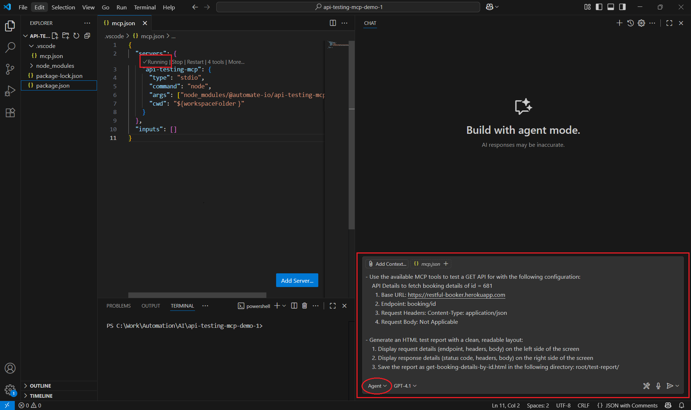
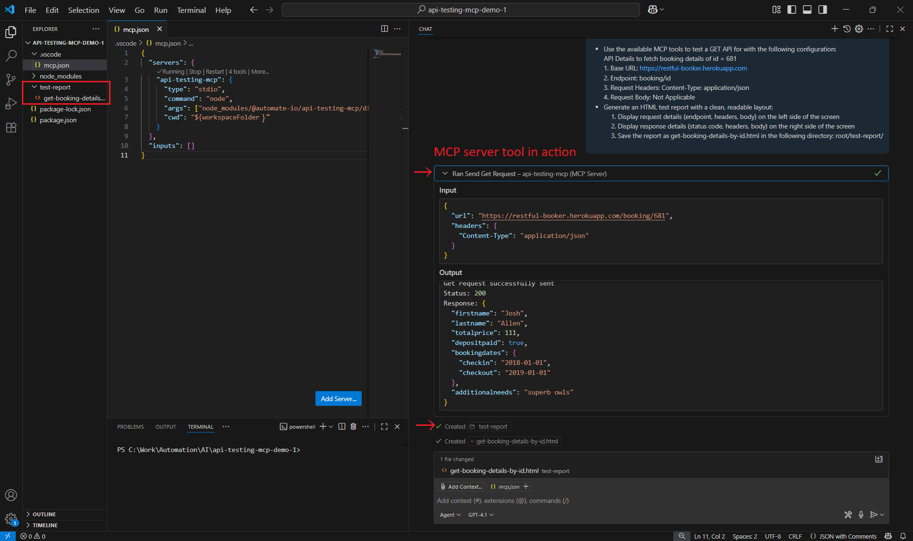

## Scenario 2:  
- To test a single endpoint (e.g. GET), provide a prompt as illustrated in the screenshot below.
<br>
    <br>
        
    <br>

<br>
<br>

## Sample prompt used in above screenshot <br>
      
```text
- Use the available MCP tools to test a GET API for with the following configuration:
- API Details to fetch booking details of id = 681
    1. Base URL: https://restful-booker.herokuapp.com
    2. Endpoint: booking/id
    3. Request Headers: Content-Type: application/json
    4. Request Body: Not applicable
- Generate an HTML test report with a clean, readable layout:
    1. Display request details (endpoint, headers, body) on the left side of the screen
    2. Display response details (status code, headers, body) on the right side of the screen
    3. Save the html report as name (http verb type + meaningful name of the api)  in the following directory: root/test-report/
```
<br>

- ❗ Note: If the test fails with above prompt, consider updating the `id` from `681` to a diffrent value in the prompt. The resource may have been deleted or become unavailable.


<br>
<br>
    
 ## Results output
- LLM will call the right MCP server tools to process your request of testing the GET api with provided test data. The output would look like below:
    
